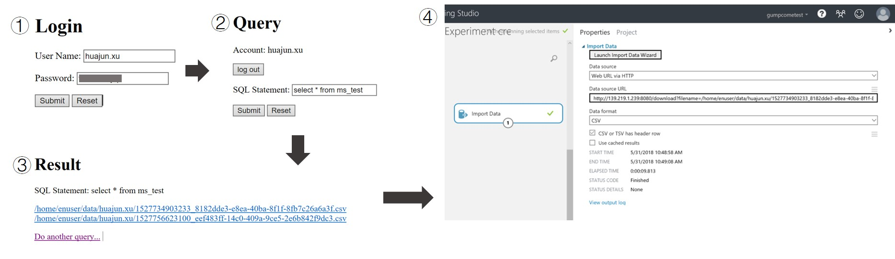
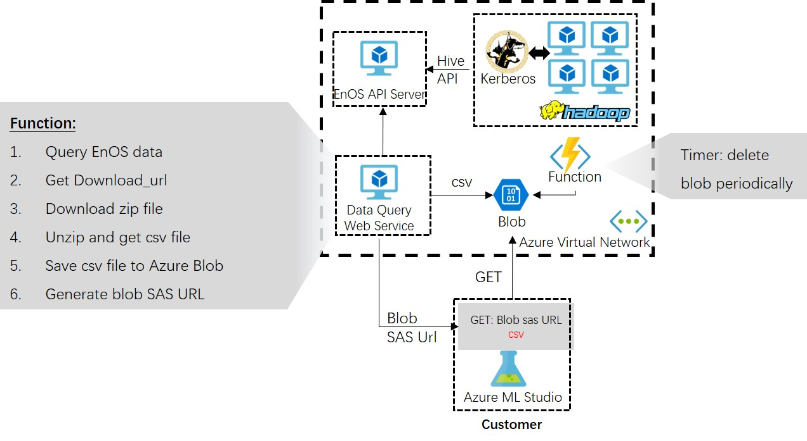

# EnOS and Azure Machine Learning Studio integration

## Background

Envision is a leading energy solution provider. It owns the world’s largest Energy IoT platform, EnOS, currently managing 100GW of energy assets globally. Envision is also the top account in Microsoft GCR.

Previously, Microsfot GCR CSE has hosted envisioning session and hackfest with Envision to drive customer to adopt AML studio. The previous hackfest has successfully built a PoC to implement a power load forecast scenario in AML Studio. 

Envision wants to integrate Azure Machine Learning Studio into the EnOS platform, so the customer of EnOS can use interactive UI of ML Studio to develop model of energy scenario and get web service.

## Customer Scenario

Data storage and analytics platform of EnOS is based on Hadoop build with Azure VM cluster (not HDInsight). As AML Studio cannot get data directly from EnOS Hive, a connector is required to connect Envision’s Hadoop in Azure and AML studio and comply with security and deployment requirement of customer, like authentication check and file encryption. Thus client user can use this connecter to trigger data query from EnOS and get the data download URL for AML Studio.

## Highlights
This case provides best practice of how to connect Azure Machine Learning Studio continuously with customer’s private or customized data source, especially in scenario of big volume of data.

Also, this case shows how Azure Function can simplify development of scheduling service.

## Architecture Description
In this github repo, we developed a web service in Java, including functions of EnOS login, Hive data query, data exported to Studio API exposure, and so on. 

This web service is hosted in Azure VM, for EnOS authentication and Hive SDK integration. We tried two methods. One is that the csv file downloaded is saved to Azure VM, and we expose a GET API for AML Studio, with expiration check. The other is that the csv file downloaded from EnOS Hive is saved to Azure Blob Storage, which can provide Share access signature URL for AML Studio to download. Azure Function runs a scheduling job of deleting expired blob every day. The architecture of the second method is as below (as the first method is all based on Azure VM)

## Code description

- Function_DeleteBlobSchedule.cs is code in Azure Function.
- apiserver folder is the java implementation of the web service, including the two methods.

